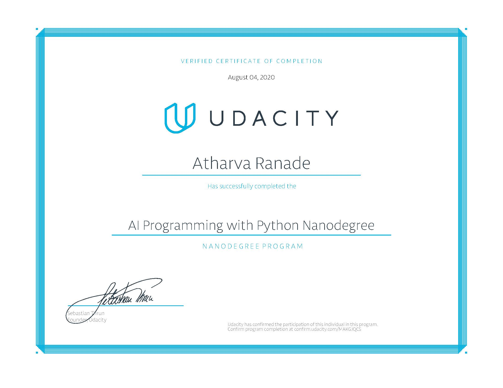

# AI Programming with Python Project

Project code for Udacity's AI Programming with Python Nanodegree program. In this project, first a code is developed for an image classifier built with PyTorch, then converted into a command line application.

### Prerequisites
Image Classifier Project work done on Ubuntu 18.04 with anaconda package installed.

## Acknowledgments
 - Udacity's AIPND course ware for directly providing links and references to some of the apis.

 - 3Blue 1Brown youtube channel videos:
    https://www.watch.youtube/com?v=aircAruvnKk 

 - Conda commands: 
    https://conda.io/docs/

 - Various neural networks and basic introduction
    https://medium.com/@sidereal/cnns-architectures-lenet-alexnet-vgg-googlenet-resnet-and-more-666091488df5   

 - for argparse:
    https://docs.python.org/3/library/argparse.html
    https://pymotw.com/3/argparse/
   
 - For passing boolean values as an argument 
     https://stackoverflow.com/questions/15008758/parsing-boolean-values-with-argparse

 - Reference for Ploting images with matplot lib
     https://stackoverflow.com/questions/41793931/plotting-images-side-by-side-using-matplotlib
     https://stackoverflow.com/questions/35286540/display-an-image-with-python/35286615
     https://matplotlib.org/users/pyplot_tutorial.html
     https://matplotlib.org/2.0.1/examples/pylab_examples/simple_plot.html
     

### Certificate

